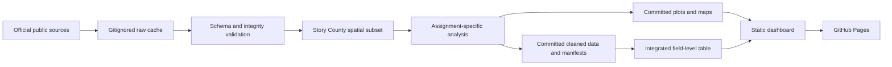

# Agricultural Data Analytics — Story County Course Recreation

This repository recreates Assignments 1–8 and a final static dashboard for an
agricultural data analytics course. It uses real public data for one coherent
study area: Story County, Iowa (Census county FIPS `19169`). No synthetic
boundaries, crop labels, imagery, NDVI, weather, or soil values are published.

## Data flow



## Setup

```bash
uv venv --python 3.12 .venv
uv pip install --python .venv/bin/python -r requirements.txt
.venv/bin/python -m unittest discover -s tests -v
```

The Python environment is pinned to Python 3.12 and the exact versions in
`requirements.txt`.

## Final project dashboard

The final deliverable is a dependency-free static dashboard published on GitHub
Pages: https://bayhnf.github.io/Agricultural-Data-Analytics/

It presents the integrated field-level results of Assignments 2–8 as KPI cards,
five figure categories (field/EDA, geospatial map, NDVI, weather time series,
soil health), and native Field ID / Soil Type filters with deterministic
agronomic captions. No backend, database, or runtime AI API is involved; all
rendering happens in the browser from committed JSON.

Technologies used: Python 3.12 (geopandas, rasterio, pandas, numpy,
matplotlib, requests, shapely, pyproj), standard-library JSON/CSV I/O, vanilla
HTML/CSS/JavaScript, GitHub Pages.

Regenerate the dashboard payload after changing any committed analysis product:

```bash
.venv/bin/python -m scripts.build_dashboard
```

Serve the docs locally (any static file server works; this one needs no
dependency):

```bash
.venv/bin/python -m http.server 8000 --directory docs
```

Then open http://localhost:8000/

### Scope notes

- The dashboard uses the established 25-field Story County dataset produced and
  validated by Assignments 2–8. The assignment PDF's reference to a
  200-field package is treated as course-template wording, not a data change.
- The supplied products contain crop classification but no measured or modeled
  yield layer, so no "Predicted Total Bushels" KPI is shown; the dashboard uses
  the available NDVI, crop, weather, and soil KPIs and discloses this
  limitation instead of inventing an estimate.

### AI usage and submission media

- AI assistance for this project is summarized honestly in
  [docs/AI_DOCS.md](docs/AI_DOCS.md).
- Submission screenshots:
  [package overview](docs/screenshots/01-package-overview.png),
  [field STORY-01](docs/screenshots/02-field-story-01.png), and
  [soil type L138B](docs/screenshots/03-soil-type-l138b.png).

## Remaining user actions

These steps require the owner's accounts and cannot be done from the
repository:

- attach the repository URL and screenshots in Google Classroom;
- add the brief final reflection ("aha!") in the Google Classroom comments;
- submit the assignment in Google Classroom.

## Raw-cache and privacy rules

- Raw downloads, COG windows, county rasters, extracted SSURGO, and other large
  inputs live under gitignored `data/raw/` and are never committed.
- `.env`, `.env.*`, credentials, tokens, and private course material are never
  tracked or read from the repository.
- Every acquisition writes a small provenance manifest recording the public
  source URL, retrieval time, checksum, and transformation notes.

## Assignment and branch map

| Branch | Assignment |
|---|---|
| `feature/assignment-01-setup` | Assignment 1: Repository and planning setup |
| `feature/assignment-02-first-data` | Assignment 2: First real data integration |
| `feature/assignment-03-eda` | Assignment 3: Exploratory data analysis |
| `feature/assignment-04-mapping` | Assignment 4: Field and soil mapping |
| `feature/assignment-05-ndvi` | Assignment 5: Real satellite imagery and NDVI |
| `feature/assignment-06-weather` | Assignment 6: Weather analysis |
| `feature/assignment-07-zonal-stats` | Assignment 7: Spatial integration and zonal statistics |
| `feature/assignment-08-soil-health` | Assignment 8: Soil health and sustainability |
| `feature/final-project-dashboard` | Final project: filterable field dashboard |

## Source limitations

- ACPF field boundaries are edited historical CLU-derived analysis units, not
  current ownership or program boundaries.
- NASA POWER weather values are gridded assimilated estimates, not station
  observations.
- Soil and carbon metrics are screening estimates, not operational farm
  recommendations.
