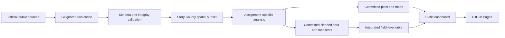

# Agricultural Data Analytics — Story County Course Recreation

This repository recreates Assignments 1–8 and a final static dashboard for an
agricultural data analytics course. It uses real public data for one coherent
study area: Story County, Iowa (Census county FIPS `19169`). No synthetic
boundaries, crop labels, imagery, NDVI, weather, or soil values are published.

## Data flow



## Setup

```bash
uv venv --python 3.12 .venv
uv pip install --python .venv/bin/python -r requirements.txt
.venv/bin/python -m unittest discover -s tests -v
```

The Python environment is pinned to Python 3.12 and the exact versions in
`requirements.txt`.

## Raw-cache and privacy rules

- Raw downloads, COG windows, county rasters, extracted SSURGO, and other large
  inputs live under gitignored `data/raw/` and are never committed.
- `.env`, `.env.*`, credentials, tokens, and private course material are never
  tracked or read from the repository.
- Every acquisition writes a small provenance manifest recording the public
  source URL, retrieval time, checksum, and transformation notes.

## Assignment and branch map

| Branch | Assignment |
|---|---|
| `feature/assignment-01-setup` | Assignment 1: Repository and planning setup |
| `feature/assignment-02-first-data` | Assignment 2: First real data integration |
| `feature/assignment-03-eda` | Assignment 3: Exploratory data analysis |
| `feature/assignment-04-mapping` | Assignment 4: Field and soil mapping |
| `feature/assignment-05-ndvi` | Assignment 5: Real satellite imagery and NDVI |
| `feature/assignment-06-weather` | Assignment 6: Weather analysis |
| `feature/assignment-07-zonal-stats` | Assignment 7: Spatial integration and zonal statistics |
| `feature/assignment-08-soil-health` | Assignment 8: Soil health and sustainability |
| `feature/final-dashboard` | Final project: static dashboard |

## Source limitations

- ACPF field boundaries are edited historical CLU-derived analysis units, not
  current ownership or program boundaries.
- NASA POWER weather values are gridded assimilated estimates, not station
  observations.
- Soil and carbon metrics are screening estimates, not operational farm
  recommendations.
