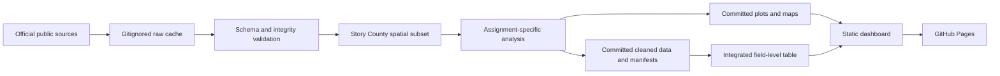

# Agricultural Data Analytics Course Recreation — Design

Date: 2026-08-13
Status: Approved; amended during implementation planning
Target repository: `bayhnf/Agricultural-Data-Analytics`

## 1. Goal

Create a new public GitHub repository that honestly recreates Assignments 1–8 and the final project for an agricultural data analytics course. The repository will use real public data for one coherent study area, preserve a sequential branch and pull-request history, provide reproducible notebooks and derived datasets, and publish a static dashboard with GitHub Pages.

The project is a clean rebuild. It will not copy another student's Git history, private Classroom exports, submitted documents, grades, comments, account details, restricted links, or credentials.

Success means:

- Assignment 1–8 requirements are represented by their own branches, pull requests, notebooks, reports, data products, and visual outputs where applicable.
- Every agricultural, soil, weather, and satellite result comes from a documented real source.
- A fresh checkout can run the documented checks and reproduce committed derived outputs after downloading the public raw inputs.
- The final dashboard contains KPI tiles and at least five visualizations produced by the earlier assignments.
- The public repository and GitHub Pages deployment contain no secrets or private course material.

## 2. Fixed Scope and Assumptions

### Study area

The single study area is Story County, Iowa. All field, crop, satellite, weather, and soil products must overlap this geography.

The field sample will contain 25 USDA ARS Agricultural Conservation Planning Framework (ACPF) field-boundary polygons. ACPF repurposes and edits pre-2008 FSA Common Land Unit boundaries for conservation planning, removes ownership and program information, and does not represent current ownership. A planning-time feasibility check found 4,046 eligible Story County polygons and at least 68 candidates in every grid cell. Selection will be deterministic:

1. Reproject the county and candidate boundaries to EPSG:5070.
2. Reject invalid, empty, duplicate, and non-agricultural (`isAG != 1`) geometries.
3. Retain fields whose centroid is inside Story County and whose geometry has at least 95% of its area inside the county.
4. Divide the county extent into a 5 × 5 grid in EPSG:5070.
5. In each grid cell, select the eligible field whose centroid is nearest the cell center, using ACPF `FBndID` as the tie-breaker.
6. Preserve the selected source geometry and calculate its area in EPSG:5070.
7. Fail rather than silently substitute synthetic fields if 25 distinct eligible fields cannot be selected.

The committed field identifiers will be stable project identifiers derived from ACPF `FBndID`. The public source identifier may remain in the provenance table.

### Time coverage

- Crop history: 2020–2023 when those source-year attributes are available.
- Sentinel-2 analysis: one cloud-masked Level-2A scene from June 1 through August 31, 2023.
- Weather: 1991–2023 daily observations, with 1991–2020 as the climatology baseline and 2023 as the highlighted analysis year.
- Soil: the current SSURGO data returned at retrieval time, with the retrieval date recorded.

### Missing final rubric

The final-project rubric was not included in the supplied assignment archive. The final implementation will therefore satisfy only the known contract: a multi-section or multi-page dashboard, at least five earlier visualizations, and KPI tiles. The minimum implementation is one responsive multi-section static page. If the missing rubric is later supplied and explicitly requires separate pages or other features, the design and plan will be amended before that work begins.

### Evidence policy

Setup evidence must be genuine. Assignment 1 may include generated command output, version checks, a rendered Mermaid diagram, and the planning documents produced in this repository. It must not include fabricated screenshots or claim that a tool was used when it was not. Any evidence that can only be produced in the user's local desktop environment will be listed as a remaining user action.

## 3. Data Sources and Provenance

Only official or primary public sources will be used:

| Dataset | Source | Project use |
|---|---|---|
| County boundary | U.S. Census Bureau TIGER/Line or Cartographic Boundary data | Exact Story County clip boundary |
| Field boundaries | USDA ARS ACPF Iowa 2019 field boundaries, archive SHA-256 `ef9e42cf4456da0c05b68db25a5f8fc02ac11d2ecd9d75fbe4ef741ebe56118f` | Public field-analysis polygons derived from historical FSA CLU boundaries |
| Crop history | USDA NASS Cropland Data Layer county rasters for FIPS `19169`, 2020–2023 | Per-field majority crop class and coverage |
| Satellite imagery | Sentinel-2 Level-2A through a public STAC catalog, preferring public COG assets | Red band, near-infrared band, scene classification, and NDVI |
| Weather | NASA POWER Daily API | Gridded assimilated temperature and precipitation estimates, rolling averages, and anomalies |
| Soil | USDA NRCS Web Soil Survey SSURGO area `IA169`, snapshot dated 2025-09-09 | Soil polygons and component properties |

Every acquisition step will write a small machine-readable provenance manifest containing:

- source organization and dataset name;
- exact request URL or query parameters without credentials;
- retrieval timestamp in UTC;
- source version, acquisition date, or scene identifier;
- checksum for downloaded files when practical;
- source and output CRS;
- transformation script or notebook;
- license or public-domain note;
- row, feature, pixel, and missing-value counts relevant to the output.

Large raw files remain in a gitignored local cache. Downloads are never embedded in Git history. Small cleaned tables, selected field geometries, summary statistics, manifests, and rendered figures are committed.

## 4. Repository Shape

The repository will use the fewest directories needed to make the assignment sequence and reproducibility clear:

```text
.
├── README.md
├── requirements.txt
├── data/
│   ├── processed/
│   │   ├── assignment-02/
│   │   ├── assignment-04/
│   │   ├── assignment-05/
│   │   ├── assignment-06/
│   │   ├── assignment-07/
│   │   └── assignment-08/
│   └── provenance/
├── docs/
│   ├── index.html
│   ├── styles.css
│   ├── assets/
│   ├── reports/
│   └── superpowers/
│       ├── plans/
│       └── specs/
├── notebooks/
│   ├── 03_field_eda.ipynb
│   ├── 04_field_mapping.ipynb
│   ├── 05_satellite_ndvi.ipynb
│   ├── 06_weather_analysis.ipynb
│   ├── 07_spatial_integration.ipynb
│   └── 08_soil_sustainability.ipynb
├── scripts/
└── tests/
```

`data/raw/` and temporary build outputs will be gitignored. A shared Python module will be introduced only when at least two assignments genuinely share nontrivial logic; otherwise short scripts remain independent. The dashboard will use plain HTML and CSS with only the minimum JavaScript needed to load committed summary data. No web framework, application server, database, agent framework, or cloud runtime is needed.

GitHub Pages will publish from `/docs` on `main`, using GitHub's native branch-based Pages support.

## 5. Data Flow



All spatial joins and area calculations will use explicit CRSs:

- EPSG:4326 for web exchange and committed GeoJSON;
- EPSG:5070 for conterminous U.S. area, distance, overlap, and area-weighted calculations;
- the native Sentinel-2 raster CRS for pixel calculations, with field geometries reprojected to match before zonal statistics.

The pipeline will never infer CRS from coordinate appearance. Missing or inconsistent CRS metadata is an error.

## 6. Assignment Deliverables

### Assignment 1 — Repository and planning setup

Branch: `feature/assignment-01-setup`

Deliverables:

- a clear README with environment and reproducibility instructions;
- a Mermaid workflow diagram that renders on GitHub;
- genuine installed-tool/version evidence where available;
- sanitized planning evidence from this project;
- an explicit note for any desktop-only evidence the user still needs to capture.

### Assignment 2 — First real data integration

Branch: `feature/assignment-02-first-data`

Deliverables:

- `data/processed/assignment-02/fields_EPSG4326.geojson`;
- `data/processed/assignment-02/cdl_EPSG4326.csv`;
- `data/processed/assignment-02/fields_with_crops.geojson`;
- `data/processed/assignment-02/field_summary.csv`;
- `data/processed/assignment-02/my_fields_map.html`;
- a summary table describing field count, area, crop coverage, nulls, and duplicate handling.

Each field receives one dominant CDL class per year through categorical raster zonal statistics. The output records the CDL code, official class name, majority fraction, and valid-pixel coverage. Fields below the required coverage remain null. The final join must preserve exactly one row per field and cannot silently duplicate fields.

### Assignment 3 — Exploratory data analysis

Branch: `feature/assignment-03-eda`

Deliverables:

- `notebooks/03_field_eda.ipynb`;
- at least three meaningful visualizations;
- two polished figures copied to `docs/assets/` for later dashboard reuse;
- written observations tied to the real sample rather than generic agricultural claims.

The analysis will cover field-area distribution, crop mix or crop sequence, missingness, and at least one relationship between field geometry and crop history.

### Assignment 4 — Field and soil mapping

Branch: `feature/assignment-04-mapping`

Deliverables:

- `notebooks/04_field_mapping.ipynb`;
- a field-and-soil map with verified CRS alignment;
- an interpretation of overlap, soil coverage, and map limitations;
- `docs/assets/field_spatial_map.png`.

### Assignment 5 — Real satellite imagery and NDVI

Branch: `feature/assignment-05-ndvi`

Deliverables:

- `notebooks/05_satellite_ndvi.ipynb`;
- a rendered single-band Sentinel-2 image;
- a cloud-masked NDVI image;
- a clear cloud-mask method and interpretation;
- `docs/reports/assignment-05-walkthrough.md`;
- the selected scene manifest and field-level NDVI summary.

Scene selection will be deterministic: query the fixed 2023 growing-season window in Element 84 Earth Search, require study-area coverage, sort by cloud cover then acquisition timestamp and scene identifier, and choose the first scene with at least 70% valid Scene Classification Layer pixels across the selected fields. Scene Classification Layer pixels representing no-data, saturated/defective data, dark or topographic shadow, cloud shadow, cloud, cirrus, or snow/ice will be excluded. The 20 m classification layer will be resampled to the 10 m red-band grid with nearest-neighbor resampling. If no valid real scene is available, the step fails with an actionable error; synthetic imagery is forbidden.

### Assignment 6 — Weather analysis

Branch: `feature/assignment-06-weather`

Deliverables:

- `notebooks/06_weather_analysis.ipynb`;
- temperature and precipitation time series;
- a rolling average;
- a 2023 anomaly relative to the 1991–2020 baseline;
- `docs/assets/weather_trends.png`.

The NASA POWER request will use the centroid of the selected fields, record all request parameters, convert fill values to null, and describe the result as a single-point gridded assimilated estimate rather than a station observation.

### Assignment 7 — Spatial integration and zonal statistics

Branch: `feature/assignment-07-zonal-stats`

Deliverables:

- `notebooks/07_spatial_integration.ipynb`;
- one field-level dataset integrating crop, soil, and NDVI;
- valid-pixel counts, coverage fractions, and `mean_ndvi` for every field;
- `docs/assets/integrated_spatial_analysis.png`.

Zonal statistics will ignore cloud-masked and no-data pixels. A field with insufficient valid imagery remains null with its coverage reported; it will not receive an imputed NDVI value.

### Assignment 8 — Soil health and sustainability

Branch: `feature/assignment-08-soil-health`

Deliverables:

- `notebooks/08_soil_sustainability.ipynb`;
- area-weighted organic matter, pH, CEC, erosion-risk proxy, and carbon-storage potential;
- coverage and missingness for each metric;
- `docs/assets/soil_health_metrics.png`.

Carbon storage will be labeled as a screening estimate, not a measurement. Its formula, depth interval, bulk-density assumption or SSURGO value, unit conversions, and excluded area will be explicit. Erosion risk will be described as a soil-property proxy and not as a complete erosion model.

### Final project — Static dashboard

Branch: `feature/final-dashboard`

Deliverables:

- a responsive multi-section `docs/index.html`;
- KPI tiles derived from committed summary data;
- at least five earlier assignment visualizations;
- sections for fields/crops, vegetation, weather, spatial integration, soil health, methods, limitations, and provenance;
- accessible headings, color contrast, keyboard-usable navigation, and descriptive image text;
- the attribution “Contains modified Copernicus Sentinel data 2023”;
- a live GitHub Pages deployment.

The dashboard will report the exact study area, sample size, imagery date, data coverage, and units. It will not present screening indicators as operational farm recommendations.

## 7. Error Handling and Data Integrity

Acquisition and transformation code will:

- download to a temporary file and atomically rename only after validation;
- preserve a valid existing cache when a refresh fails;
- reject HTML error pages, empty responses, unexpected schemas, and corrupt archives;
- retry only transient network failures and rate limits with a small bounded retry count;
- validate required columns, unique keys, expected merge cardinality, geometry validity, CRS, row counts, and spatial overlap;
- keep source nulls visible and calculate coverage rather than silently filling values;
- fail loudly when an official source cannot produce the required real data;
- write deterministic outputs with stable sorting and fixed selection rules.

No fallback may generate synthetic boundaries, crop labels, satellite bands, NDVI values, weather observations, or soil measurements. USDA NASS Crop Sequence Boundaries are excluded because USDA describes that product's boundaries as algorithmically generated; this project instead uses ACPF field-analysis polygons and states their historical and edited nature explicitly.

## 8. Testing and Verification

Implementation follows test-first development. Each nontrivial parser, selector, merge, raster calculation, and summary contract receives one smallest useful failing check before its implementation.

The repository-level verification will cover:

- standard-library unit tests for deterministic selection, schema checks, merge cardinality, cloud masking, NDVI arithmetic, area weighting, and summary calculations;
- in-memory toy numeric or geometry inputs used only to verify algorithms, never published as agricultural findings;
- contract checks against the committed real derived files, including required columns, row counts, CRS, valid ranges, and referential integrity;
- notebook execution from a clean kernel without hidden state;
- confirmation that every dashboard asset exists and the HTML references resolve;
- a secret/private-data scan and a tracked-file size check;
- a clean Git status after regeneration.

The primary verification commands will be documented in the README and will use installed project tools rather than a custom task runner unless repetition proves one necessary.

## 9. Git and GitHub Workflow

The repository starts with a new `main` history containing this design and the implementation plan. Work then proceeds in order:

1. Create the assignment branch from the current `main`.
2. Add a failing test or contract check.
3. Implement the smallest change that satisfies that assignment.
4. Regenerate and verify only the affected deliverables.
5. Ask DeepSeek and GLM 5.2 subagents for independent requirement and implementation review, without exposing credentials or private archives.
6. Correct verified findings.
7. Commit focused changes, push the branch, and open a pull request.
8. Record test evidence and data provenance in the pull request.
9. Merge before creating the next assignment branch.

The final branch order is:

1. `feature/assignment-01-setup`
2. `feature/assignment-02-first-data`
3. `feature/assignment-03-eda`
4. `feature/assignment-04-mapping`
5. `feature/assignment-05-ndvi`
6. `feature/assignment-06-weather`
7. `feature/assignment-07-zonal-stats`
8. `feature/assignment-08-soil-health`
9. `feature/final-dashboard`

Codex remains responsible for integration and verification. Subagents may analyze, implement isolated plan tasks, or review diffs, but they may not receive the GitHub token, OAuth material, browser cookies, or unrelated private course files.

The GitHub repository will be public. The existing GitHub token will be supplied to individual GitHub CLI commands through the process environment only; it will not be printed, written into Git configuration, copied into the repository, or committed.

## 10. Security and Publication Rules

The public repository must exclude:

- `.env` files, OAuth client files, access tokens, refresh tokens, cookies, and authorization codes;
- Classroom exports and original assignment documents;
- names, email addresses, grades, comments, meeting links, restricted URLs, and account identifiers from private course material;
- full national boundary archives, raw satellite scenes, and other large source downloads;
- copied history or attribution that implies another student's work is the user's work.

Before every push, tracked files and staged diffs will be checked for known secret patterns, private filenames, restricted domains, and unexpectedly large files. The GitHub token will be used only for repository creation, branch pushes, pull requests, merges, Pages configuration, and read-back verification authorized by this project.

## 11. Definition of Done

The recreation is complete only when:

- all nine feature branches have corresponding merged pull requests in sequence;
- all required notebooks, processed outputs, reports, figures, and manifests exist;
- the documented verification suite passes on the final `main`;
- the repository contains no private source material or credentials;
- the public GitHub repository can be cloned;
- GitHub Pages serves the final dashboard;
- source URLs, retrieval dates, transformations, units, caveats, and missingness are documented;
- any evidence that requires the user's desktop is clearly identified rather than fabricated.

Anything outside these requirements—authentication systems, databases, APIs, agent frameworks, cloud workers, synthetic demo data, or a custom dashboard framework—is deliberately excluded.
